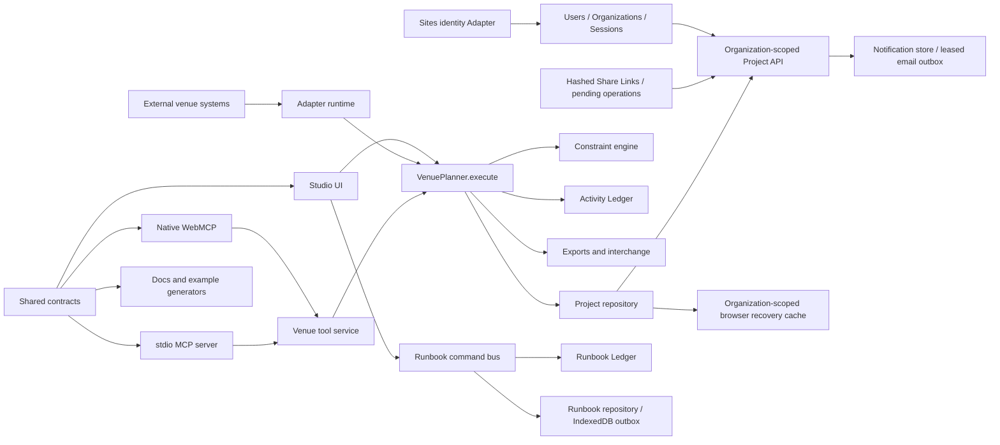
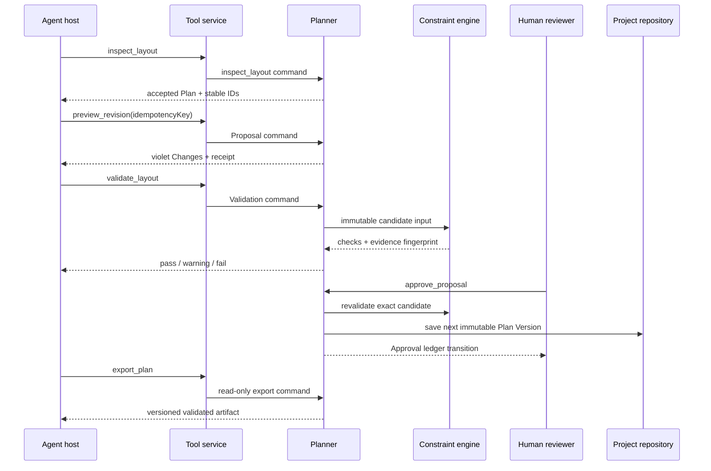

# VenueMind architecture

VenueMind is one domain runtime with three callers: Studio UI, native WebMCP, and the standalone MCP server. The planner owns mutation rules; callers never recreate them.

## Component map

## Source map

| Responsibility | Authoritative source |
| --- | --- |
| Commands, tools, schemas, examples, and tool-to-command mapping | `src/contracts/venue-contracts.js` |
| Command execution and versioned planner state | `src/domain/venue-planner.js` |
| Deterministic Constraint registry | `src/domain/constraint-engine.js` |
| Human Roles, Agent Grants, permissions, and Approval policy | `src/domain/authorization.js` |
| Users, Organizations, Memberships, invitations, and Sessions | `src/domain/accounts.js` and `worker/account-repository.ts` |
| Trusted hosting identity Adapter | `worker/authentication.ts` |
| Stable errors and remediation | `src/domain/errors.js` |
| Ledger sealing, verification, and replay | `src/domain/activity-ledger.js` |
| Canonical UTC and RFC3339 timestamp validation | `src/domain/timestamps.js` and `src/domain/event-schedule.js` |
| Tool authorization and dispatch | `src/tools/venue-tool-service.js` |
| Browser registration and bounded results | `src/webmcp/` |
| Standalone MCP resources, prompts, progress, and stdio | `packages/mcp-server/src/` |
| Browser Project persistence and recovery | `src/persistence/project-store.js` |
| Event Day Runbook domain, command bus, and anchored ledger | `src/domain/event-day-runbook.js` and `src/domain/runbook-command-bus.js` |
| Browser Runbook cache and offline outbox | `src/persistence/runbook-store.js` |
| Runbook audit exports | `src/interchange/runbook-exports.js` |
| Organization-scoped Worker API and Project repository | `worker/index.ts` and `worker/project-repository.ts` |
| Share Links, pending-operation reconciliation, Notification Preferences, notifications, and leased email outbox | `src/domain/sharing.js` and `worker/sharing-repository.ts` |
| Numbered database migrations, integrity, backup, and restore | `db/migrations/`, `worker/database-migrations.ts`, and `scripts/database-maintenance.mjs` |
| Interchange and operational exports | `src/interchange/` |
| External adapter contracts, Proposal staging, aggregate registration reconciliation, idempotency, durable webhook receipt, retry, and secret boundaries | `src/integrations/` |
| Calendar event normalization and Event-to-Project mapping | `src/integrations/adapters/calendar-event-adapter.js` |
| Registration and ticketing aggregate normalization | `src/integrations/adapters/registration-ticketing-adapter.js` |
| Operational Resource Snapshot reconciliation and explicit substitution preview | `src/domain/operational-resources.js` and `src/integrations/adapters/operational-resource-adapter.js` |
| Canonical docs registry | `src/docs/` |
| Generated public artifacts | `scripts/generate-*.mjs` and `public/` |

## Supervised planning flow

## Deep boundaries

- `VenuePlanner.execute` is the only planning mutation boundary.
- The Runbook command bus is a separate operational mutation boundary bound immutably to accepted Plan evidence; it never writes the Project planning snapshot.
- `createVenueToolService` is the common authorization and dispatch boundary for WebMCP and MCP.
- `venueToolContracts` is the public agent contract registry; agent-only behavior does not live in registration adapters.
- `evaluators` in the Constraint engine is the deterministic evidence registry.
- `sealActivityLedger`, `verifyActivityLedger`, and `replayActivityLedger` are the integrity boundary for accepted history.
- Project persistence stores complete normalized snapshots; UI component state is never authoritative Plan truth.
- Collaboration Events carry durable revision invalidation and Presence Leases carry awareness; neither can mutate accepted Plan truth.
- SSE reconnect uses a per-Project previous-event chain. A missed link forces an authoritative reload through Project Record Revision checks.
- Public Share Links are bearer capabilities stored only as SHA-256 hashes. Reviewer access pins one retained Proposal revision; pending operations reconcile idempotently and fail closed. Notification payloads carry fixed body codes plus allowlisted stable references, creation-time preferences determine in-app visibility, and email delivery records success only after the injected provider confirms it.
- Adapter import and synchronization translate external records into the canonical Proposal and Change model for exactly one base Plan Version. Every Change carries executable `spatialEffects`, closed-union `planningEffects`, or both; accepted Plan and Event Brief truth still change only through ordinary human Approval.
- External ID Mappings keep source-system identity distinct from both Inventory Item Template IDs and Project Object Instance IDs, and retain source system, source version, synchronization time, and checksum evidence.
- Calendar Event Snapshots retain only allowlisted descriptive labels as adapter evidence. Attendance and schedule deltas become typed Requirement Changes; title, location, and organizer labels never enter the Proposal or Activity Ledger.
- Every Project-mapped adapter result, including metadata-only `no-changes` evidence, is verified against an injected server-owned Project context before idempotency persistence. Review loading repeats the check against the planner aggregate.
- Calendar Planning Effects must match durable server-owned bindings retained with accepted Event Brief truth, including operation-to-Requirement IDs, Requirement categories and Constraint IDs, accepted Brief before-values, and the Constraint registry. Production restore, package import, and Project duplication derive from the same bindings; restore canonicalizes the closed union across active and retained historical Proposal Branches.
- An adapter batch with no planning Changes has `no-changes` status and no Proposal; it cannot enter review or advance a Plan Version.
- Adapter staging checksums cover the executable Proposal, mappings, source records, cursor, and warnings. Batch and Proposal IDs are checksum-derived, and every persisted reload is reverified before use.
- Durable webhook rows are keyed by adapter version, source system, and event ID; both inserted and duplicate store returns must match that identity and a checksum recomputed from normalized content.
- Event schedule instants use canonical RFC3339 date-times with known explicit offsets matching the named IANA timezone, including DST transitions; the RFC3339 unknown-local-offset form `-00:00` is rejected. Planning Effect synchronization evidence uses the shared canonical UTC timestamp validator.
- The processed-batch store is the adapter idempotency boundary. A repeated import returns the original staging result without creating another Proposal; production persistence must implement the same atomic `putIfAbsent` contract.
- Webhook acceptance requires an injected atomic store keyed by adapter version, source system, and event ID. This survives runtime restarts, closes concurrent delivery races, and keeps equal event IDs from different sources distinct.
- Live operational supply remains a checksum-bound Operational Resource Snapshot outside accepted Plan truth. Only an explicitly selected compatible Resource Substitution Option can enter the ordinary Proposal, Validation, Lock, human Approval, versioning, and ledger path as a Resource Binding update.
- Adapter capability scopes and scoped secret references are checked independently. Adapter handlers receive secret values only through the secret-store boundary, never through persisted configuration or dead letters.
- Registration and ticketing provider input is recursively screened before invocation IDs, checksums, processed-result storage, dead letters, or webhook replay storage. Project occupancy requirements come separately from repository-derived trusted adapter context. Only aggregate Ticket Class, zone allocation, accessibility requirement, forecast, and Check-in Aggregate fields survive normalization; deep result validation recomputes the reconciliation proof, and this read model does not invent a non-spatial planning-effect shape. Webhook replay uses an injected atomic store keyed by Adapter version, source system, and event ID.
- Every import and synchronization declares `importResultMode`. `reviewable-proposal` always passes the canonical staging-batch invariant; `aggregate-snapshot` requires an adapter-specific validator for both new and duplicate outputs before processed-batch storage or return.

## Add a command

1. Add one exact variant to `venueCommandSchema` in `src/contracts/venue-contracts.js`. Define required fields, bounds, and `additionalProperties` explicitly.
2. Implement the branch in `VenuePlanner.execute`. Mutations require an idempotency key, return stable result IDs, append an Activity Ledger event, and preserve accepted truth unless the command is human-authorized Approval or accepted-history navigation.
3. Map the command in `COMMAND_PERMISSION` inside `src/domain/authorization.js`.
4. For an agent-facing command, add one `venueToolContracts` entry and map it in `commandForVenueTool`. Approval and destructive Project deletion remain absent.
5. Add stable runtime errors to `src/domain/errors.js`, then add output IDs and applicable errors to `src/docs/reference-data.js` and `src/docs/pages/reference.js` where inference is insufficient.
6. Add domain tests, authorization tests, and WebMCP/MCP conformance tests as applicable.
7. Run `npm run generate:contracts`, `npm run generate:docs`, `npm test`, and `npm run check:generated`.

The command is complete when its runtime behavior, permission, generated schema, tool surfaces, docs page, examples, errors, receipts, ledger evidence, and tests agree.

## Add a Constraint

1. Add the evaluator name to `venueConstraintSchema.properties.evaluator.enum`.
2. Implement a pure evaluator in `src/domain/constraint-engine.js` and register it in `evaluators`.
3. Return ordered evidence with stable object and evidence IDs, normalized units, actual value, threshold, comparator, and remediation.
4. Add or migrate seeded Constraint records that use the evaluator.
5. Add the evaluator category, evidence family, and units to `CONSTRAINT_REFERENCE`.
6. Test pass, fail, not-applicable, stable ordering, fingerprint invalidation, and Approval blocking behavior.
7. Regenerate contracts and docs, then run the full test and drift gates.

The Constraint is complete when identical immutable input produces byte-equivalent evidence and every changed relevant input invalidates the cached result.
