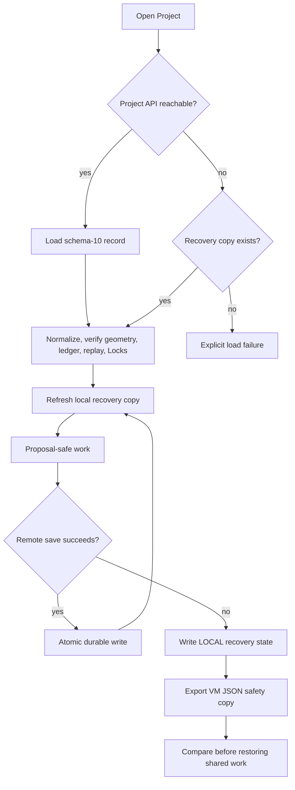

# Persistence and recovery

The Organization-owned durable Project record is authoritative when reachable. Browser storage is an Organization- and Project-scoped recovery cache. An Interchange Package is a portable safety copy and create-only import source; it intentionally carries no Organization authority.

## State flow

## Save semantics

- Every accepted or Proposal state is serialized as one schema-versioned Project record.
- The remote repository is authoritative when its endpoint succeeds.
- A browser recovery write occurs before or alongside each remote save attempt.
- `REMOTE` and `LOCAL` status are user-visible; local-only work is never presented as synchronized.
- Import Preview performs checksum, schema, geometry, stable-ID, Lock, ledger, and replay checks before create-only commit.

## Recovery order

1. Preserve the current local record with a VM JSON export.
2. Restore the Project endpoint before accepting shared changes.
3. Compare Project ID, updated time, Plan Version, Proposal ID, latest receipt, and ledger head.
4. Preserve divergent work as a Proposal Branch or imported copy; never overwrite newer accepted truth silently.
5. Validate the reconciled Proposal and obtain ordinary human Approval.

## Integrity failures

- `LEDGER_INTEGRITY_FAILED`: quarantine the record and use the last verified export or backup.
- `PROJECT_ID_CONFLICT`: import under an explicitly new Project lineage; import never overwrites.
- `LOCK_CONFLICT`: keep the protected accepted object and resolve the Proposal through normal review.
- Unsupported schema: preserve the original bytes, add a tested sequential migration, and retry Import Preview.

Each authoritative Project record carries a positive `revision` and a strong ETag. Creation uses `If-None-Match: *`; updates use the exact current ETag in `If-Match`. Missing preconditions fail with `428`, stale revisions fail with structured `412 PROJECT_REVISION_CONFLICT`, and no conflict is reported as a successful offline save.

The browser retains the last synchronized base separately from the local recovery record. A bounded three-way comparison retries independent field changes once. Overlapping planning state remains local, appears as `SYNC CONFLICT`, and can be attached to current remote truth as an auditable Recovery Branch. Normal Proposal conflict detection, rebase, Validation, and human Approval still apply.

Numbered database migrations, checksum verification, integrity/orphan inspection, Project safety export, backup, staged restore, and D1 Point-in-Time Recovery are specified in `docs/database-operations.md`.

Real-time clients receive durable revision events rather than raw snapshot patches. Reconnect resumes from the last Collaboration Cursor; a missing chain link forces a full authoritative reload. Presence uses expiring leases and is never part of Project truth. See `docs/realtime-collaboration.md`.

Public Share Links resolve through hashed bearer tokens, expire at a fixed instant, and fail closed outside the `active` lifecycle state. Reviewer Share Links expose one retained Proposal revision. Durable pending create and revoke operations reconcile their Activity Ledger transitions idempotently after an interrupted write. Notification records use fixed body codes plus an allowlist of stable references, creation-time preferences control in-app visibility, and the leased email outbox records delivery only after injected-provider success. See `docs/sharing-and-notifications.md`.

## Event-day operations

Event Day Runbooks do not live inside the Project snapshot. Each Runbook Version has a frozen accepted baseline, independent task revisions, transitions, idempotency receipts, and an anchored hash-chained ledger. The browser uses IndexedDB for the Runbook cache and ordered outbox; localStorage is not the operational queue.

Reconnect sends the original commands in client sequence order. The server returns a result for every item and commits each accepted transition, task projection, receipt, and ledger entry atomically. Applied and already-applied items leave the outbox. Conflicts and rejections remain visible and recoverable. See `docs/event-day-runbooks.md` and ADR 0027.
